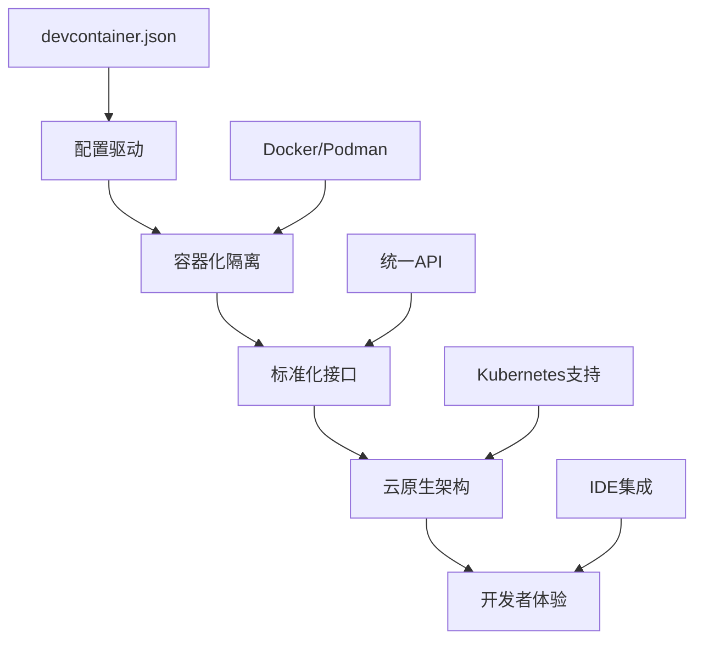
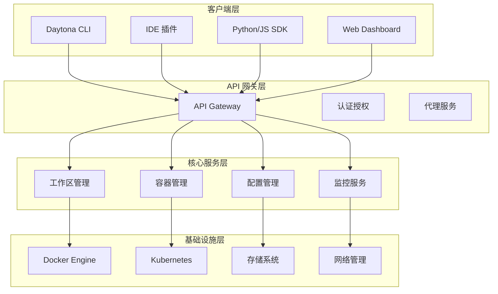
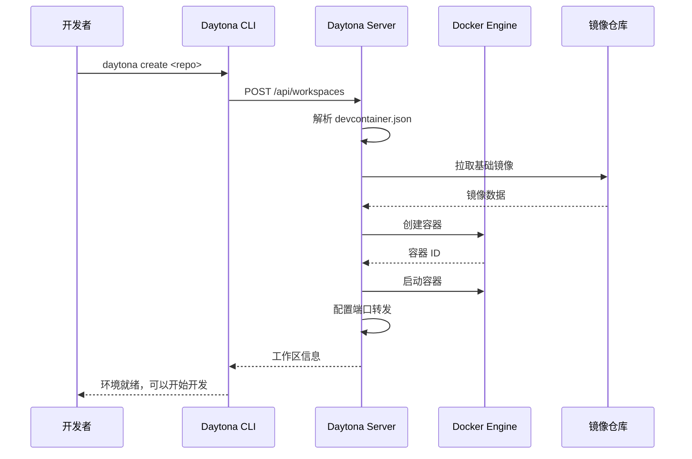

# Daytona 深度解析：现代开发环境管理的革命性工具

## 目录
1. [Daytona 核心概念](#1-daytona-核心概念)
2. [架构设计深度分析](#2-架构设计深度分析)
3. [与其他工具对比](#3-与其他工具对比)
4. [核心功能详解](#4-核心功能详解)
5. [Dev Container 生态](#5-dev-container-生态)
6. [实际应用场景](#6-实际应用场景)
7. [最佳实践与模式](#7-最佳实践与模式)
8. [企业级部署策略](#8-企业级部署策略)

## 1. Daytona 核心概念

### 1.1 什么是 Daytona？

Daytona 是一个**开源的开发环境管理平台**，专注于解决现代软件开发中的环境一致性、快速启动和团队协作问题。它的核心理念是：

> **"一次配置，处处运行"** - 通过标准化的容器技术和配置驱动的方式，确保开发环境在任何地方都能完全一致地运行。

### 1.2 核心价值主张

#### 🎯 解决的核心问题
- **环境漂移**：开发、测试、生产环境不一致
- **配置复杂**：新团队成员环境搭建耗时长
- **资源浪费**：本地环境占用大量系统资源
- **版本冲突**：不同项目依赖版本冲突

#### ✨ 提供的核心价值
- **即时可用**：几分钟内创建完整开发环境
- **完全隔离**：每个项目独立的容器环境
- **配置标准化**：基于 Dev Container 规范
- **团队一致性**：所有开发者使用相同环境

### 1.3 Daytona 的设计哲学



## 2. 架构设计深度分析

### 2.1 整体架构



### 2.2 核心组件详解

#### 🏗️ Daytona Server
```yaml
# 核心职责
功能模块:
  - 工作区生命周期管理
  - 容器编排和调度
  - 用户认证和授权
  - 资源监控和优化
  - API 网关和路由

技术栈:
  - 后端: Go (高性能、并发)
  - 数据库: PostgreSQL + Redis
  - 容器: Docker/Containerd
  - 编排: Kubernetes (可选)
```

#### 🔧 Configuration Engine
```json
{
  "devcontainer": {
    "parser": "解析 devcontainer.json",
    "validator": "验证配置有效性",
    "optimizer": "优化容器配置",
    "cache": "配置缓存机制"
  },
  "features": {
    "resolver": "Feature 依赖解析",
    "installer": "自动安装工具",
    "lifecycle": "生命周期管理"
  }
}
```

#### 🏃‍♂️ Runtime Manager
```go
// 伪代码示例：容器生命周期管理
type RuntimeManager struct {
    containerEngine ContainerEngine
    networkManager  NetworkManager
    storageManager  StorageManager
}

func (rm *RuntimeManager) CreateWorkspace(config *DevContainerConfig) (*Workspace, error) {
    // 1. 解析配置
    parsedConfig := rm.parseConfig(config)
    
    // 2. 准备镜像
    image := rm.prepareImage(parsedConfig.Image)
    
    // 3. 创建容器
    container := rm.containerEngine.Create(image, parsedConfig)
    
    // 4. 配置网络
    rm.networkManager.AttachNetwork(container)
    
    // 5. 挂载存储
    rm.storageManager.MountVolumes(container, parsedConfig.Mounts)
    
    // 6. 启动容器
    return rm.startContainer(container)
}
```

### 2.3 数据流架构



## 3. 与其他工具对比

### 3.1 竞品对比分析

| 特性 | Daytona | Gitpod | Codespaces | DevPod | Vagrant |
|------|---------|--------|------------|---------|---------|
| **开源** | ✅ | ❌ | ❌ | ✅ | ✅ |
| **本地部署** | ✅ | ❌ | ❌ | ✅ | ✅ |
| **云端集成** | ✅ | ✅ | ✅ | ❌ | ❌ |
| **GPU 支持** | ✅ | ✅ | ✅ | ✅ | ⚠️ |
| **多 IDE 支持** | ✅ | ⚠️ | ⚠️ | ✅ | ✅ |
| **企业级功能** | ✅ | ✅ | ✅ | ❌ | ❌ |
| **成本** | 免费 | 付费 | 付费 | 免费 | 免费 |

### 3.2 技术栈对比

#### Daytona vs Gitpod
```yaml
Daytona:
  优势:
    - 完全开源，无供应商锁定
    - 本地部署，数据完全可控
    - 支持多种容器运行时
    - 企业级权限管理
  劣势:
    - 社区相对较新
    - 云端集成需要自建

Gitpod:
  优势:
    - 成熟的云端解决方案
    - 强大的预构建功能
    - 开箱即用的集成
  劣势:
    - 闭源，供应商锁定
    - 成本较高
    - 数据隐私考虑
```

#### Daytona vs GitHub Codespaces
```yaml
Daytona:
  优势:
    - 跨平台支持（不限 GitHub）
    - 本地+云端混合部署
    - 完全的配置控制权
  劣势:
    - 需要自己管理基础设施

GitHub Codespaces:
  优势:
    - 与 GitHub 深度集成
    - Microsoft 生态支持
    - 零配置启动
  劣势:
    - 仅限 GitHub 生态
    - 成本高昂
    - 配置灵活性有限
```

## 4. 核心功能详解

### 4.1 工作区管理 (Workspace Management)

#### 🎯 工作区生命周期
```python
# 工作区状态机
class WorkspaceState:
    CREATING = "creating"      # 创建中
    RUNNING = "running"        # 运行中
    STOPPED = "stopped"        # 已停止
    STARTING = "starting"      # 启动中
    STOPPING = "stopping"      # 停止中
    ERROR = "error"           # 错误状态
    DESTROYED = "destroyed"   # 已销毁

# 状态转换
transitions = {
    CREATING: [RUNNING, ERROR],
    RUNNING: [STOPPING, ERROR],
    STOPPED: [STARTING, DESTROYED],
    STARTING: [RUNNING, ERROR],
    STOPPING: [STOPPED, ERROR],
    ERROR: [STARTING, DESTROYED]
}
```

#### 🔧 工作区配置
```json
{
  "workspace": {
    "id": "ws-uuid-12345",
    "name": "my-project",
    "repository": {
      "url": "https://github.com/user/repo",
      "branch": "main"
    },
    "devcontainer": {
      "configFilePath": ".devcontainer/devcontainer.json"
    },
    "resources": {
      "cpu": "2 cores",
      "memory": "4GB",
      "storage": "20GB"
    },
    "network": {
      "ports": [3000, 8080, 5432],
      "exposed": true
    }
  }
}
```

### 4.2 配置管理 (Configuration Management)

#### 📋 Dev Container 配置解析
```javascript
// 配置继承和合并机制
class DevContainerConfig {
  constructor(configPath) {
    this.baseConfig = this.loadBaseConfig(configPath);
    this.features = this.resolveFeatures();
    this.finalConfig = this.mergeConfigs();
  }

  loadBaseConfig(path) {
    // 支持多种配置格式
    if (path.endsWith('.json')) {
      return JSON.parse(fs.readFileSync(path));
    } else if (path.endsWith('.yaml')) {
      return yaml.parse(fs.readFileSync(path));
    }
  }

  resolveFeatures() {
    // 解析和安装 Dev Container Features
    return this.baseConfig.features?.map(feature => {
      return this.featureRegistry.resolve(feature);
    }) || [];
  }

  mergeConfigs() {
    // 合并基础配置、特性配置和用户配置
    return deepMerge(
      this.baseConfig,
      ...this.features.map(f => f.config),
      this.userOverrides
    );
  }
}
```

#### 🎨 特性系统 (Features)
```yaml
# Dev Container Features 示例
features:
  "ghcr.io/devcontainers/features/python:1":
    version: "3.11"
    installTools: true
    
  "ghcr.io/devcontainers/features/docker-in-docker:2":
    version: "20.10"
    moby: true
    
  "ghcr.io/devcontainers/features/kubectl-helm-minikube:1":
    version: "latest"
    helm: "3.12"
    minikube: "1.30"

# 自定义特性
customFeatures:
  "./local-features/ai-tools":
    cuda: "11.8"
    pytorch: "2.0"
    tensorflow: "2.13"
```

### 4.3 容器编排 (Container Orchestration)

#### 🐳 多运行时支持
```go
// 容器运行时抽象层
type ContainerRuntime interface {
    Create(config *ContainerConfig) (*Container, error)
    Start(containerID string) error
    Stop(containerID string) error
    Remove(containerID string) error
    Exec(containerID string, cmd []string) (*ExecResult, error)
    Logs(containerID string) (io.ReadCloser, error)
}

// Docker 实现
type DockerRuntime struct {
    client *docker.Client
}

// Podman 实现  
type PodmanRuntime struct {
    client *podman.Client
}

// Kubernetes 实现
type KubernetesRuntime struct {
    clientset *kubernetes.Clientset
}
```

#### 🔗 网络管理
```yaml
# 网络配置示例
network:
  mode: "bridge"  # bridge, host, none
  
  # 端口映射
  ports:
    - container: 3000
      host: 3000
      protocol: "tcp"
    - container: 5432
      host: 15432
      protocol: "tcp"
  
  # 自定义网络
  networks:
    - name: "dev-network"
      driver: "bridge"
      ipam:
        subnet: "172.20.0.0/16"
  
  # DNS 配置
  dns:
    - "8.8.8.8"
    - "1.1.1.1"
```

### 4.4 资源管理 (Resource Management)

#### 💾 存储管理
```yaml
# 存储策略
storage:
  # 工作区数据持久化
  workspace:
    type: "volume"
    driver: "local"
    size: "20GB"
    backup: true
    
  # 缓存优化
  cache:
    # 包管理器缓存
    package_managers:
      npm: "/root/.npm"
      pip: "/root/.cache/pip"
      go: "/go/pkg/mod"
    
    # 构建缓存
    build:
      docker_layer: true
      source_maps: true
    
  # 共享卷
  shared:
    - name: "shared-datasets"
      path: "/shared/data"
      readonly: true
```

#### 🖥️ GPU 支持
```json
{
  "gpu": {
    "enabled": true,
    "runtime": "nvidia",
    "capabilities": ["gpu", "compute", "utility"],
    "devices": [
      {
        "deviceId": "0",
        "memory": "8GB"
      }
    ],
    "environment": {
      "NVIDIA_VISIBLE_DEVICES": "all",
      "NVIDIA_DRIVER_CAPABILITIES": "compute,utility"
    }
  }
}
```

## 5. Dev Container 生态

### 5.1 标准化配置格式

#### 📝 devcontainer.json 深度解析
```json
{
  // 基础配置
  "name": "My Development Environment",
  "image": "mcr.microsoft.com/devcontainers/typescript-node:18",
  
  // 或使用 Dockerfile
  "build": {
    "dockerfile": "Dockerfile",
    "context": "..",
    "args": {
      "NODE_VERSION": "18"
    }
  },
  
  // Features - 可复用的开发工具
  "features": {
    "ghcr.io/devcontainers/features/aws-cli:1": {},
    "ghcr.io/devcontainers/features/docker-in-docker:2": {
      "version": "20.10",
      "moby": true
    }
  },
  
  // IDE 定制
  "customizations": {
    "vscode": {
      "extensions": [
        "ms-vscode.vscode-typescript-next",
        "esbenp.prettier-vscode"
      ],
      "settings": {
        "typescript.preferences.quoteStyle": "single"
      }
    },
    "jetbrains": {
      "backend": "IntelliJ IDEA",
      "plugins": ["JavaScript", "TypeScript"]
    }
  },
  
  // 生命周期钩子
  "onCreateCommand": "npm install",
  "updateContentCommand": "npm update",
  "postCreateCommand": "npm run setup",
  "postStartCommand": "npm run dev &",
  
  // 网络配置
  "forwardPorts": [3000, 8080],
  "portsAttributes": {
    "3000": {
      "label": "Frontend",
      "onAutoForward": "notify"
    }
  },
  
  // 用户和权限
  "remoteUser": "node",
  "containerUser": "node",
  "updateRemoteUserUID": true,
  
  // 挂载配置
  "mounts": [
    "source=${localWorkspaceFolder}/data,target=/workspace/data,type=bind",
    "source=project-cache,target=/cache,type=volume"
  ],
  
  // 环境变量
  "containerEnv": {
    "NODE_ENV": "development",
    "DEBUG": "*"
  },
  
  // 运行时配置
  "runArgs": [
    "--cap-add=SYS_PTRACE",
    "--security-opt", "seccomp=unconfined"
  ]
}
```

### 5.2 特性生态系统 (Features Ecosystem)

#### 🧩 官方 Features
```yaml
# 编程语言
languages:
  - "ghcr.io/devcontainers/features/python:1"
  - "ghcr.io/devcontainers/features/node:1"
  - "ghcr.io/devcontainers/features/go:1"
  - "ghcr.io/devcontainers/features/rust:1"
  - "ghcr.io/devcontainers/features/java:1"

# 开发工具
tools:
  - "ghcr.io/devcontainers/features/git:1"
  - "ghcr.io/devcontainers/features/github-cli:1"
  - "ghcr.io/devcontainers/features/docker-in-docker:2"
  - "ghcr.io/devcontainers/features/kubectl-helm-minikube:1"

# 数据库
databases:
  - "ghcr.io/devcontainers/features/postgres:1"
  - "ghcr.io/devcontainers/features/mysql:1"
  - "ghcr.io/devcontainers/features/redis:1"
  - "ghcr.io/devcontainers/features/mongodb:1"

# AI/ML 工具
ai_ml:
  - "ghcr.io/devcontainers/features/nvidia-cuda:1"
  - "ghcr.io/devcontainers/features/python:1"
  - "ghcr.io/devcontainers/features/anaconda:1"
```

#### 🛠️ 自定义 Features
```bash
# Feature 目录结构
my-custom-feature/
├── devcontainer-feature.json
├── install.sh
├── README.md
└── test/
    ├── test.sh
    └── scenarios.json
```

```json
// devcontainer-feature.json
{
  "id": "my-ai-tools",
  "version": "1.0.0",
  "name": "AI Development Tools",
  "description": "Installs PyTorch, TensorFlow, and Jupyter",
  "options": {
    "version": {
      "type": "string",
      "proposals": ["pytorch", "tensorflow", "both"],
      "default": "both",
      "description": "Which ML framework to install"
    },
    "cudaVersion": {
      "type": "string",
      "default": "11.8",
      "description": "CUDA version"
    }
  },
  "installsAfter": [
    "ghcr.io/devcontainers/features/python:1",
    "ghcr.io/devcontainers/features/nvidia-cuda:1"
  ]
}
```

```bash
#!/bin/bash
# install.sh

set -e

VERSION=${VERSION:-"both"}
CUDA_VERSION=${CUDAVERSION:-"11.8"}

echo "Installing AI Development Tools..."

# 安装 PyTorch
if [ "$VERSION" = "pytorch" ] || [ "$VERSION" = "both" ]; then
    pip install torch torchvision torchaudio --index-url https://download.pytorch.org/whl/cu${CUDA_VERSION//./}
fi

# 安装 TensorFlow
if [ "$VERSION" = "tensorflow" ] || [ "$VERSION" = "both" ]; then
    pip install tensorflow[and-cuda]
fi

# 安装通用工具
pip install jupyter jupyterlab matplotlib seaborn pandas numpy scikit-learn

echo "AI Development Tools installation completed!"
```

## 6. 实际应用场景

### 6.1 场景一：AI/ML 项目开发

#### 🧠 机器学习环境配置
```json
{
  "name": "ML Research Environment",
  "image": "nvidia/cuda:11.8-devel-ubuntu22.04",
  
  "features": {
    "ghcr.io/devcontainers/features/python:1": {
      "version": "3.10"
    },
    "ghcr.io/devcontainers/features/nvidia-cuda:1": {
      "installCudnn": true,
      "cudnnVersion": "8"
    },
    "./features/ml-tools": {
      "frameworks": ["pytorch", "tensorflow", "jax"],
      "version": "latest"
    }
  },
  
  "customizations": {
    "vscode": {
      "extensions": [
        "ms-python.python",
        "ms-toolsai.jupyter",
        "ms-python.vscode-pylance",
        "charliermarsh.ruff"
      ]
    }
  },
  
  "forwardPorts": [8888, 6006, 8265],
  "portsAttributes": {
    "8888": {"label": "Jupyter Lab"},
    "6006": {"label": "TensorBoard"},
    "8265": {"label": "Ray Dashboard"}
  },
  
  "postCreateCommand": [
    "pip install -r requirements.txt",
    "jupyter lab --generate-config",
    "echo 'c.ServerApp.token = \"\"' >> ~/.jupyter/jupyter_lab_config.py"
  ],
  
  "mounts": [
    "source=${localWorkspaceFolder}/datasets,target=/workspace/data,type=bind",
    "source=ml-cache,target=/root/.cache,type=volume"
  ],
  
  "containerEnv": {
    "CUDA_VISIBLE_DEVICES": "all",
    "PYTHONPATH": "/workspace",
    "JUPYTER_ENABLE_LAB": "yes"
  }
}
```

#### 🚀 分布式训练环境
```yaml
# docker-compose.yml for distributed training
version: '3.8'
services:
  master:
    build: .
    environment:
      - RANK=0
      - WORLD_SIZE=3
      - MASTER_ADDR=master
      - MASTER_PORT=23456
    ports:
      - "8888:8888"
    
  worker1:
    build: .
    environment:
      - RANK=1
      - WORLD_SIZE=3
      - MASTER_ADDR=master
      - MASTER_PORT=23456
    depends_on:
      - master
      
  worker2:
    build: .
    environment:
      - RANK=2
      - WORLD_SIZE=3
      - MASTER_ADDR=master
      - MASTER_PORT=23456
    depends_on:
      - master
```

### 6.2 场景二：微服务开发

#### 🏗️ 全栈开发环境
```json
{
  "name": "Microservices Development",
  "dockerComposeFile": "docker-compose.dev.yml",
  "service": "app",
  "workspaceFolder": "/workspace",
  
  "features": {
    "ghcr.io/devcontainers/features/node:1": {
      "version": "18"
    },
    "ghcr.io/devcontainers/features/docker-in-docker:2": {},
    "ghcr.io/devcontainers/features/kubectl-helm-minikube:1": {}
  },
  
  "customizations": {
    "vscode": {
      "extensions": [
        "ms-vscode.vscode-typescript-next",
        "bradlc.vscode-tailwindcss",
        "ms-kubernetes-tools.vscode-kubernetes-tools",
        "ms-vscode.vscode-docker"
      ]
    }
  },
  
  "forwardPorts": [3000, 3001, 3002, 5432, 6379],
  
  "postCreateCommand": [
    "npm install",
    "docker compose up -d postgres redis",
    "npm run db:migrate"
  ]
}
```

```yaml
# docker-compose.dev.yml
version: '3.8'
services:
  app:
    build: 
      context: .
      dockerfile: .devcontainer/Dockerfile
    volumes:
      - ..:/workspace:cached
    command: sleep infinity
    
  frontend:
    build: ./frontend
    ports:
      - "3000:3000"
    volumes:
      - ./frontend:/app
      
  backend:
    build: ./backend
    ports:
      - "3001:3001"
    volumes:
      - ./backend:/app
    depends_on:
      - postgres
      - redis
      
  postgres:
    image: postgres:15
    environment:
      POSTGRES_DB: devdb
      POSTGRES_USER: dev
      POSTGRES_PASSWORD: devpass
    ports:
      - "5432:5432"
    volumes:
      - postgres_data:/var/lib/postgresql/data
      
  redis:
    image: redis:7-alpine
    ports:
      - "6379:6379"

volumes:
  postgres_data:
```

### 6.3 场景三：团队协作开发

#### 👥 标准化团队环境
```javascript
// 团队配置管理
class TeamEnvironmentManager {
  constructor() {
    this.teamConfigs = new Map();
    this.loadTeamStandards();
  }

  loadTeamStandards() {
    // 加载团队标准配置
    this.teamConfigs.set('frontend', {
      baseImage: 'node:18-alpine',
      features: [
        'ghcr.io/devcontainers/features/node:1',
        'ghcr.io/devcontainers/features/git:1'
      ],
      extensions: [
        'esbenp.prettier-vscode',
        'bradlc.vscode-tailwindcss',
        'ms-vscode.vscode-typescript-next'
      ],
      settings: {
        'editor.formatOnSave': true,
        'editor.codeActionsOnSave': {
          'source.fixAll.eslint': true
        }
      }
    });

    this.teamConfigs.set('backend', {
      baseImage: 'python:3.11-slim',
      features: [
        'ghcr.io/devcontainers/features/python:1',
        'ghcr.io/devcontainers/features/docker-in-docker:2'
      ],
      extensions: [
        'ms-python.python',
        'ms-python.black-formatter',
        'charliermarsh.ruff'
      ]
    });
  }

  generateConfig(projectType, customizations = {}) {
    const baseConfig = this.teamConfigs.get(projectType);
    return this.mergeConfigs(baseConfig, customizations);
  }

  validateConfig(config) {
    // 验证配置是否符合团队标准
    return this.configValidator.validate(config);
  }
}
```

## 7. 最佳实践与模式

### 7.1 配置管理最佳实践

#### 📋 配置文件组织
```
项目根目录/
├── .devcontainer/
│   ├── devcontainer.json          # 主配置文件
│   ├── Dockerfile                 # 自定义镜像
│   ├── docker-compose.yml         # 多服务编排
│   ├── post-create.sh            # 创建后脚本
│   └── features/                  # 自定义特性
│       ├── ai-tools/
│       ├── monitoring/
│       └── security/
├── .daytona/
│   ├── workspace.yaml            # 工作区配置
│   ├── team-settings.json        # 团队设置
│   └── templates/                # 环境模板
│       ├── ml-research.json
│       ├── web-dev.json
│       └── data-science.json
```

#### 🔧 配置继承策略
```json
{
  "基础配置": {
    "extends": "../base/devcontainer.json",
    "name": "Project Specific Environment"
  },
  
  "模块化配置": {
    "features": {
      "file:./features/database": {},
      "file:./features/monitoring": {},
      "file:./features/security": {}
    }
  },
  
  "环境变量管理": {
    "containerEnv": {
      "NODE_ENV": "${localEnv:NODE_ENV:development}",
      "API_KEY": "${localEnv:API_KEY}",
      "DATABASE_URL": "${containerEnv:DATABASE_URL}"
    }
  }
}
```

### 7.2 性能优化策略

#### ⚡ 镜像优化
```dockerfile
# 多阶段构建优化
FROM node:18-alpine AS base
WORKDIR /app
COPY package*.json ./
RUN npm ci --only=production

FROM base AS development
RUN npm ci
COPY . .
# 开发时工具
RUN npm install -g nodemon typescript

FROM base AS production
COPY --from=base /app/node_modules ./node_modules
COPY . .
RUN npm run build
```

#### 💾 缓存策略
```yaml
# 缓存配置
cache_strategy:
  # 层级缓存
  layer_cache:
    enabled: true
    registry: "registry.company.com/cache"
    
  # 依赖缓存
  dependency_cache:
    npm: "/root/.npm"
    pip: "/root/.cache/pip"
    go: "/go/pkg/mod"
    
  # 构建缓存
  build_cache:
    docker_buildx: true
    build_args_hash: true
```

### 7.3 安全最佳实践

#### 🔒 安全配置
```json
{
  "security": {
    "nonRootUser": true,
    "remoteUser": "developer",
    "containerUser": "developer",
    
    "capabilities": {
      "drop": ["ALL"],
      "add": ["CHOWN", "DAC_OVERRIDE"]
    },
    
    "securityOpt": [
      "no-new-privileges:true",
      "seccomp=default"
    ],
    
    "readOnlyRootFilesystem": false,
    "tmpfs": {
      "/tmp": "noexec,nosuid,size=100m"
    }
  },
  
  "secrets": {
    "management": "external",
    "provider": "vault",
    "mounts": [
      {
        "source": "vault:secret/dev/api-keys",
        "target": "/run/secrets/api-keys",
        "mode": "0400"
      }
    ]
  }
}
```

### 7.4 监控和调试

#### 📊 监控集成
```yaml
# 监控配置
monitoring:
  metrics:
    enabled: true
    exporters:
      - prometheus
      - datadog
    endpoints:
      - /metrics
      - /health
      
  logging:
    driver: "json-file"
    options:
      max-size: "10m"
      max-file: "3"
    centralized:
      enabled: true
      endpoint: "https://logs.company.com"
      
  tracing:
    enabled: true
    jaeger:
      endpoint: "http://jaeger:14268"
    sampling_rate: 0.1
```

#### 🐛 调试配置
```json
{
  "debugging": {
    "vscode": {
      "configurations": [
        {
          "name": "Debug Node.js",
          "type": "node",
          "request": "launch",
          "program": "${workspaceFolder}/src/index.js",
          "env": {
            "NODE_ENV": "development"
          }
        },
        {
          "name": "Debug Python",
          "type": "python",
          "request": "launch",
          "program": "${workspaceFolder}/main.py",
          "console": "integratedTerminal"
        }
      ]
    },
    
    "network": {
      "debugPorts": [9229, 5678],
      "remoteDebugging": true
    }
  }
}
```

## 8. 企业级部署策略

### 8.1 架构选择

#### 🏢 单租户部署
```yaml
# 企业私有云部署
deployment:
  type: "on-premise"
  architecture: "single-tenant"
  
  infrastructure:
    kubernetes:
      version: "1.28"
      nodes: 10
      resources:
        cpu: "64 cores per node"
        memory: "256GB per node"
        storage: "2TB SSD per node"
    
    storage:
      type: "ceph"
      replication: 3
      backup: true
      
    network:
      cni: "cilium"
      ingress: "nginx"
      service_mesh: "istio"
```

#### ☁️ 多租户 SaaS 部署
```yaml
# SaaS 模式部署
deployment:
  type: "saas"
  architecture: "multi-tenant"
  
  tenancy:
    isolation: "namespace"
    resource_quotas: true
    network_policies: true
    
  scaling:
    horizontal_pod_autoscaler: true
    vertical_pod_autoscaler: true
    cluster_autoscaler: true
    
  security:
    pod_security_policies: true
    rbac: true
    network_policies: true
    admission_controllers:
      - "PodSecurityPolicy"
      - "ResourceQuota"
      - "LimitRanger"
```

### 8.2 运维管理

#### 🚀 CI/CD 集成
```yaml
# GitLab CI 集成示例
stages:
  - validate
  - build
  - test
  - deploy

validate_devcontainer:
  stage: validate
  script:
    - daytona config validate .devcontainer/devcontainer.json
    - daytona security scan .devcontainer/
  rules:
    - changes:
        - .devcontainer/**/*

build_environment:
  stage: build
  script:
    - daytona build --tag $CI_COMMIT_SHA .devcontainer/
    - daytona push registry.company.com/environments/$PROJECT_NAME:$CI_COMMIT_SHA
  only:
    - main
    - develop

test_environment:
  stage: test
  script:
    - daytona create --image registry.company.com/environments/$PROJECT_NAME:$CI_COMMIT_SHA
    - daytona exec npm test
    - daytona exec pytest
  after_script:
    - daytona cleanup
```

#### 📈 资源管理
```go
// 资源配额管理
type ResourceManager struct {
    quotaManager  QuotaManager
    usageTracker  UsageTracker
    costOptimizer CostOptimizer
}

func (rm *ResourceManager) AllocateWorkspace(userID, projectID string, requirements ResourceRequirements) (*Workspace, error) {
    // 1. 检查用户配额
    quota := rm.quotaManager.GetUserQuota(userID)
    if !quota.CanAllocate(requirements) {
        return nil, ErrQuotaExceeded
    }
    
    // 2. 优化资源分配
    optimized := rm.costOptimizer.OptimizeAllocation(requirements)
    
    // 3. 创建工作区
    workspace := rm.createWorkspace(optimized)
    
    // 4. 跟踪使用情况
    rm.usageTracker.TrackWorkspace(workspace)
    
    return workspace, nil
}
```

### 8.3 治理和合规

#### 📋 策略管理
```yaml
# 企业策略配置
governance:
  policies:
    security:
      - name: "no-privileged-containers"
        enforce: true
        description: "禁止特权容器"
        
      - name: "mandatory-security-scanning"
        enforce: true
        description: "强制安全扫描"
        
    compliance:
      - name: "data-residency"
        enforce: true
        regions: ["eu-central-1", "us-east-1"]
        
      - name: "audit-logging"
        enforce: true
        retention: "7 years"
        
    resource:
      - name: "cpu-limits"
        enforce: true
        max_cpu: "8 cores"
        
      - name: "memory-limits"
        enforce: true
        max_memory: "32GB"
```

#### 🔍 审计和监控
```json
{
  "audit": {
    "events": [
      "workspace.created",
      "workspace.accessed",
      "workspace.modified",
      "workspace.deleted",
      "user.login",
      "user.permission_changed",
      "configuration.changed"
    ],
    "storage": {
      "type": "elasticsearch",
      "retention": "2555 days",
      "encryption": true
    },
    "alerts": {
      "suspicious_activity": true,
      "policy_violation": true,
      "resource_threshold": true
    }
  }
}
```

## 总结

Daytona 作为现代开发环境管理的创新解决方案，通过以下核心优势革命性地改变了开发体验：

### 🎯 核心价值
1. **标准化**：基于 Dev Container 规范的一致性环境
2. **自动化**：一键创建复杂开发环境
3. **隔离性**：完全隔离的容器化环境
4. **可扩展**：从本地到云端的无缝扩展

### 🚀 技术优势
1. **开源开放**：无供应商锁定，完全可控
2. **云原生**：现代容器技术栈
3. **多平台**：支持多种操作系统和架构
4. **企业级**：完整的治理和合规功能

### 💡 未来展望
随着云原生技术的发展和远程开发的普及，Daytona 将在以下方面继续演进：
- **AI 驱动的环境优化**
- **更深度的 IDE 集成**
- **边缘计算支持**
- **增强的安全特性**

Daytona 不仅仅是一个开发工具，更是现代软件开发方式的范式转变，它让"环境即代码"成为现实，为开发团队带来前所未有的效率和一致性体验。