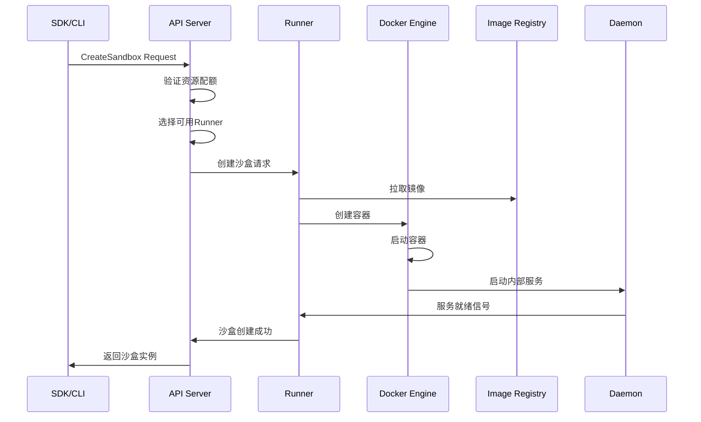

# Daytona 深度架构分析：运行原理与链路细节

## 概述

Daytona 是一个为AI代码生成设计的安全、弹性的云端代码执行平台。它提供了完整的容器化沙盒环境，支持多种编程语言的代码安全执行，并具备强大的资源管理和隔离能力。

## 一、宏观架构设计

### 1.1 核心组件架构

Daytona 采用微服务架构，主要由以下核心组件构成：

```
┌─────────────────────────────────────────────────────────────────┐
│                        Daytona Platform                         │
├─────────────────────────────────────────────────────────────────┤
│  ┌─────────────┐  ┌─────────────┐  ┌─────────────┐  ┌─────────┐ │
│  │  Dashboard  │  │  API Server │  │    Proxy    │  │   CLI   │ │
│  │ (Frontend)  │  │  (NestJS)   │  │  (Routing)  │  │  (Go)   │ │
│  └─────────────┘  └─────────────┘  └─────────────┘  └─────────┘ │
├─────────────────────────────────────────────────────────────────┤
│  ┌─────────────┐  ┌─────────────┐  ┌─────────────┐              │
│  │   Runner    │  │   Daemon    │  │   Toolbox   │              │
│  │   (Go)      │  │   (Go)      │  │   (HTTP)    │              │
│  └─────────────┘  └─────────────┘  └─────────────┘              │
├─────────────────────────────────────────────────────────────────┤
│  ┌─────────────┐  ┌─────────────┐  ┌─────────────┐              │
│  │ PostgreSQL  │  │    Redis    │  │   Docker    │              │
│  │ (Database)  │  │   (Cache)   │  │ (Container) │              │
│  └─────────────┘  └─────────────┘  └─────────────┘              │
└─────────────────────────────────────────────────────────────────┘
```

### 1.2 组件职责分析

#### API Server (NestJS)
- **技术栈**: TypeScript + NestJS + TypeORM
- **职责**: 
  - 用户认证与授权 (JWT/OAuth)
  - 沙盒生命周期管理
  - 快照管理与版本控制
  - 资源配额管理
  - 组织权限管理
  - WebSocket实时通信
- **核心模块**:
  - `SandboxModule`: 沙盒管理
  - `AuthModule`: 认证授权
  - `UserModule`: 用户管理
  - `OrganizationModule`: 组织管理
  - `NotificationModule`: 实时通知

#### Runner (Go)
- **技术栈**: Go + Docker API
- **职责**:
  - 容器生命周期管理
  - 资源监控与调度
  - 镜像拉取与缓存
  - 快照构建与管理
  - 网络代理与端口映射
- **核心功能**:
  - Docker容器编排
  - 容器状态监控
  - 资源使用统计
  - 快照缓存管理

#### Daemon (Go)
- **技术栈**: Go + HTTP Server
- **职责**:
  - 容器内部工具箱服务
  - 文件系统操作
  - 进程管理
  - 终端服务
  - 代码执行代理
- **核心服务**:
  - Toolbox HTTP API
  - Terminal SSH服务 (端口22222)
  - 项目目录管理

#### Dashboard (Frontend)
- **技术栈**: 现代前端框架
- **职责**:
  - 用户界面
  - 沙盒管理界面
  - 实时状态展示
  - 资源监控面板

## 二、核心业务流程分析

### 2.1 沙盒创建流程

沙盒创建是Daytona的核心流程，涉及多个组件的协调：



#### 详细步骤分析

1. **资源验证阶段**
   ```typescript
   // apps/api/src/sandbox/services/sandbox.service.ts
   private async validateOrganizationQuotas(
     organization: Organization,
     cpu: number,
     memory: number,
     disk: number,
     excludeSandboxId?: string,
   ): Promise<void>
   ```
   - 检查组织CPU/内存/磁盘配额
   - 验证单个沙盒资源限制
   - 计算当前资源使用量

2. **Runner选择算法**
   ```typescript
   // apps/api/src/sandbox/services/runner.service.ts
   async getRandomAvailableRunner(params: GetRunnerParams): Promise<Runner>
   ```
   - 基于地区、类型、快照兼容性筛选
   - 按使用率排序选择负载最低的Runner
   - 支持快照亲和性调度

3. **容器创建流程**
   ```go
   // apps/runner/pkg/docker/create.go
   func (d *DockerClient) Create(ctx context.Context, sandboxDto dto.CreateSandboxDTO) (string, error)
   ```
   - 镜像拉取与验证
   - 容器配置生成
   - 卷挂载设置
   - 网络配置

### 2.2 代码执行链路

代码执行是Daytona的核心能力，涉及多层代理：

```
SDK Client → API Server → Runner → Docker Container → Daemon → Process Execution
```

#### 执行流程详解

1. **SDK层面**
   ```typescript
   // libs/sdk-typescript/src/Sandbox.ts
   async codeRun(code: string, timeout = 60): Promise<CodeRunResult>
   ```
   - 代码预处理
   - 超时控制
   - 结果解析

2. **API代理层**
   ```typescript
   // 通过Toolbox API代理到Runner
   this.toolboxApi.codeRun(sandboxId, { code, timeout })
   ```

3. **Runner执行层**
   ```go
   // apps/runner处理代码执行请求
   // 转发到容器内的Daemon服务
   ```

4. **容器内执行**
   ```go
   // apps/daemon/pkg/toolbox/process/
   // 在容器内实际执行代码
   ```

### 2.3 文件系统操作

Daytona支持完整的文件系统操作：

```go
// apps/daemon/pkg/toolbox/fs/
fsController := r.Group("/files")
{
    // 读取操作
    fsController.GET("/", fs.ListFiles)
    fsController.GET("/download", fs.DownloadFile)
    fsController.GET("/info", fs.GetFileInfo)
    
    // 写入操作
    fsController.POST("/upload", fs.UploadFile)
    fsController.POST("/folder", fs.CreateFolder)
    fsController.POST("/move", fs.MoveFile)
    
    // 删除操作
    fsController.DELETE("/", fs.DeleteFile)
}
```

## 三、关键技术实现

### 3.1 容器化隔离机制

#### Docker容器配置
```go
// apps/runner/pkg/docker/create.go
func (d *DockerClient) getContainerConfigs(ctx context.Context, sandboxDto dto.CreateSandboxDTO, volumeMountPathBinds []string) (*container.Config, *container.HostConfig, *network.NetworkingConfig, error)
```

- **安全隔离**: 容器间完全隔离
- **资源限制**: CPU/内存/磁盘配额控制
- **网络隔离**: 独立的网络命名空间
- **文件系统**: 独立的文件系统空间

#### 容器生命周期管理
```go
// Runner中的容器状态管理
type SandboxState int

const (
    SandboxStateUnknown SandboxState = iota
    SandboxStateCreating
    SandboxStateStarting
    SandboxStateStarted
    SandboxStateStopped
    SandboxStateDestroyed
)
```

### 3.2 快照系统

快照是Daytona的核心特性，支持环境的快速复制和版本管理：

```typescript
// apps/api/src/sandbox/services/snapshot.service.ts
class SnapshotService {
  async create(createSnapshotDto: CreateSnapshotDto): Promise<Snapshot>
  async findAll(organizationId: string): Promise<Snapshot[]>
  async findOne(id: string): Promise<Snapshot>
}
```

#### 快照构建流程
1. **容器状态保存**: 将运行中的容器保存为镜像
2. **镜像推送**: 上传到私有镜像仓库
3. **元数据记录**: 在数据库中记录快照信息
4. **快照分发**: 将快照分发到各个Runner节点

### 3.3 实时通信机制

#### WebSocket网关
```typescript
// apps/api/src/notification/gateways/notification.gateway.ts
@WebSocketGateway({
  path: '/api/socket.io/',
  transports: ['websocket'],
})
export class NotificationGateway
```

支持的事件类型：
- `SandboxEvents.CREATED`: 沙盒创建
- `SandboxEvents.STATE_UPDATED`: 状态更新
- `SnapshotEvents.CREATED`: 快照创建
- `VolumeEvents.CREATED`: 卷创建

#### Redis集群支持
```typescript
// 使用Redis适配器支持多实例扩展
const pubClient = this.redis.duplicate()
const subClient = pubClient.duplicate()
this.server.adapter(createAdapter(pubClient, subClient))
```

### 3.4 资源调度算法

#### Runner负载均衡
```typescript
// apps/api/src/sandbox/services/runner.service.ts
async findAvailableRunners(params: GetRunnerParams): Promise<Runner[]> {
  // 按使用率排序，选择负载最低的前10个
  return runners.sort((a, b) => a.used / a.capacity - b.used / b.capacity).slice(0, 10)
}
```

#### 智能调度策略
1. **地区亲和性**: 优先选择同地区的Runner
2. **快照亲和性**: 优先选择已缓存目标快照的Runner
3. **负载均衡**: 基于CPU和内存使用率
4. **故障转移**: 自动排除不可用的Runner

## 四、数据流架构

### 4.1 数据存储架构

#### PostgreSQL数据模型
```sql
-- 核心实体关系
Sandbox (沙盒)
├── Organization (组织)
├── Runner (运行器)
├── Snapshot (快照)
├── Volume (卷)
└── BuildInfo (构建信息)
```

#### Redis缓存策略
```go
// apps/runner/pkg/cache/
type IRunnerCache interface {
    Get(ctx context.Context, sandboxId string) *models.CacheData
    SetSandboxState(ctx context.Context, sandboxId string, state enums.SandboxState)
    SetBackupState(ctx context.Context, sandboxId string, state enums.BackupState)
}
```

### 4.2 API设计模式

#### RESTful API设计
```typescript
// apps/api/src/sandbox/controllers/sandbox.controller.ts
@Controller('sandbox')
export class SandboxController {
  @Post()
  create(@Body() createSandboxDto: CreateSandboxDto)
  
  @Get()
  findAll(@Query() labels?: Record<string, string>)
  
  @Get(':id')
  findOne(@Param('id') id: string)
  
  @Delete(':id')
  remove(@Param('id') id: string)
}
```

#### SDK抽象层
```typescript
// libs/sdk-typescript/src/Daytona.ts
export class Daytona {
  async create(params?: CreateSandboxParams): Promise<Sandbox>
  async get(sandboxId: string): Promise<Sandbox>
  async list(labels?: Record<string, string>): Promise<Sandbox[]>
  async delete(sandbox: Sandbox): Promise<void>
}
```

## 五、安全与隔离机制

### 5.1 多层安全架构

1. **网络隔离**
   - 容器间网络隔离
   - 端口访问控制
   - 代理服务安全

2. **文件系统隔离**
   - 独立的文件系统命名空间
   - 用户权限控制
   - 卷挂载安全

3. **进程隔离**
   - 容器进程隔离
   - 资源限制
   - 权限控制

### 5.2 认证与授权

#### JWT Token验证
```typescript
// apps/api/src/auth/jwt.strategy.ts
export class JwtStrategy extends PassportStrategy(Strategy) {
  async validate(payload: any) {
    return { userId: payload.sub, username: payload.username }
  }
}
```

#### 组织级权限控制
```typescript
// 基于组织的多租户架构
@Injectable()
export class OrganizationService {
  async findByUser(userId: string): Promise<Organization[]>
  async validateUserAccess(userId: string, organizationId: string): Promise<boolean>
}
```

## 六、性能优化策略

### 6.1 容器启动优化

#### 快照预缓存
```typescript
// apps/api/src/sandbox/services/sandbox-warm-pool.service.ts
export class SandboxWarmPoolService {
  async fetchWarmPoolSandbox(criteria: WarmPoolCriteria): Promise<Sandbox>
  async createWarmPoolSandbox(warmPoolItem: WarmPool): Promise<Sandbox>
}
```

#### 容器预热池
- 预创建常用环境的容器
- 快速分配给新的沙盒请求
- 减少冷启动时间

### 6.2 资源优化

#### 智能缓存策略
```go
// apps/runner/pkg/cache/in-memory.go
type InMemoryRunnerCache struct {
    Cache         map[string]*models.CacheData
    RetentionDays int
}
```

#### 资源回收机制
```typescript
// 定时清理任务
@Cron('45 * * * * *')
private async handleCheckRunners() {
  // 检查Runner状态
  // 回收资源
  // 更新使用统计
}
```

## 七、监控与可观测性

### 7.1 指标收集

#### 容器指标
```go
// apps/runner/pkg/common/metrics.go
var (
    ContainerOperationDuration = prometheus.NewHistogramVec(
        prometheus.HistogramOpts{
            Name: "container_operation_duration_seconds",
            Help: "Duration of container operations",
        },
        []string{"operation"},
    )
)
```

#### 业务指标
- 沙盒创建成功率
- 代码执行延迟
- 资源使用率
- 错误率统计

### 7.2 日志聚合

#### 结构化日志
```go
// 统一的日志格式
log.WithFields(log.Fields{
    "sandboxId": sandboxId,
    "operation": "create",
    "duration": time.Since(startTime),
}).Info("Container created successfully")
```

## 八、扩展性设计

### 8.1 水平扩展

#### 多Runner集群
```typescript
// Runner动态注册与发现
export class RunnerService {
  async create(createRunnerDto: CreateRunnerDto): Promise<Runner>
  async findAvailableRunners(params: GetRunnerParams): Promise<Runner[]>
  async updateSchedulingStatus(id: string, unschedulable: boolean): Promise<Runner>
}
```

#### 负载均衡
- 基于地理位置的就近调度
- 基于负载的智能分配
- 故障自动转移

### 8.2 垂直扩展

#### 资源弹性伸缩
```typescript
// 动态资源调整
async validateOrganizationQuotas(
  organization: Organization,
  cpu: number,
  memory: number,
  disk: number,
): Promise<void>
```

## 九、总结

Daytona采用了现代云原生架构设计，通过以下核心特性实现了安全、高效的AI代码执行平台：

1. **微服务架构**: 模块化设计，易于维护和扩展
2. **容器化隔离**: 基于Docker的强安全隔离
3. **智能调度**: 基于负载和亲和性的智能资源调度
4. **快照系统**: 快速环境复制和版本管理
5. **实时通信**: WebSocket支持的实时状态同步
6. **多租户架构**: 组织级的资源隔离和权限控制
7. **性能优化**: 预热池、缓存等多种优化策略

这种架构设计使得Daytona能够在保证安全性的同时，提供高性能、高可用的AI代码执行服务，满足现代AI应用开发的需求。